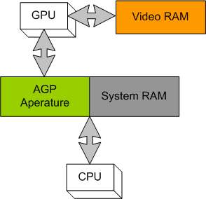

# GPUPrograming

ITESO GPU programming Hwks and reads


Vertical operations and horizontal operations:


Application:

Point product between two vectors.

With the vertical product ans horizontal sum.
```c
V0=[1,2,3,4]
V1=[4,3,2,1]
Dot(V0,V1) = 20
C<-V0*V1= [4,6,6,4] <- vertical operation
C := C h+ C // apply horizontal sumation
[10,10,10,10]
```
- - -
```c
V0=[1,2,3,4]
V1=[5,6,7,8]
Dot(V0,V1) = 70
C<-V0*V1= [5,12,21,32] <- vertical operation
C := C h+ C // apply horizontal sumation
[5,12,21,32]
[5+12,21+32,5+12,32+21]
[17, 53, 17, 53]
[70,70,70,70]
```

Visual studio<br>
debug flag: `_DEBUG` <br>
Cambia cuando se cambia el modo de release a debug


* Group is the minimum unit of computation for directx.
* Every unit is a cube with 3 dimensions
* Grupo: Equipo de hilos que comparten  variables globales.
* The cpu starts cubes in the GPU.

[https://msdn.microsoft.com/en-us/library/windows/desktop/ff476405(v=vs.85).aspx](https://msdn.microsoft.com/en-us/library/windows/desktop/ff476405(v=vs.85).aspx)
```
int x; // this variable is only visible for this Group
// define the number and structure of the Group
[numthreads(1,1,1)]
void main()
{

}
```

### [How the data is copied from CPU->GPU](http://stackoverflow.com/questions/15814211/when-is-the-data-copied-to-gpu-memory)

DirectX transfers data from system memory into video memory when the creation methods
are called. An example of a creation method is `ID3D11Device::CreateBuffer`. This method requires a pointer to the memory location of where the data is, so it can be copied from
system RAM to video RAM. However, if the pointer that is passed into, is a null pointer
then just sets the amount of space, so you can copy the data later.


Example:
```C
// Fill in a buffer descrition
D3D11_BUFFER_DESC bufferDesc;
bufferDesc.Usage            = D3D11_USAGE_DYNAMIC;
bufferDesc.ByteWidth        = sizeof(Vertex_dynamic) * m_iHowManyVertices;
bufferDesc.BindFlags        = D3D11_BIND_VERTEX_BUFFER;
bufferDesc.CPUAccessFlags   = D3D11_CPU_ACCESS_WRITE;
bufferDesc.MiscFlags        = 0;
bufferDesc.StructureByteStride = NULL;

// Fill in the subresource data.
D3D11_SUBRESOURCE_DATA InitData;
InitData.pSysMem = &_vData[0];
InitData.SysMemPitch = NULL;
InitData.SysMemSlicePitch = NULL;

// Create the vertex buffer.
/*Data is being copyed right now*/
m_pDxDevice->CreateBuffer(&bufferDesc, &InitData, &m_pDxVertexBuffer_PiecePos);

```

## CPU vs GPU

| CPU | GPU     |
| :------------- | :------------- |
| Low latency memory       | high bandwidth memory       |
| random accesses | sequential accesses |
| 0.1 Tflop compute | 1Tflop computing |
| 1GFlop/watt | 10GFlog/watt |


The CPU is designed to handle random access operations.

## DirectCompute Memory Model
### register based memory

### device memory
### group shared memory


### _The PC as an asymetric Multiprocessor system_


## Structured buffers
| method | descrition     |
| :------------- | :------------- |
| GetDimemensions| Gets the resource dimensions |
| Load           | Reads the buffer data       |
| Operator[]     | Returns a **read only** resource variable       |


### RWStructuredBuffer
A read write buffer that can take a `T` type that is a structure.
context & factory


```c
StructuredBuffer Input;
RWStructuredBuffer Output; /* Read write StructuredBuffer */

int x;

[numthreads(10,8,3)]

void main(uint3 id:SV_DispatchThreadID)
{

}
```
## Constant Buffers


  Constant buffer:
  Es una regrion de memoria interna en el GPU para parametrizar el funcionamiento de los compute shaders, antes de que estos se inicien.

  Una vez iniciada la ejecucion de un compute shader, esas varaibles son consideradas de solo lectura

  La ventaja de los constant buffers es que el cpu puede actualizar el valor de estas variables en cualquier momento y de manera eficiente.

  1. Crear un buffer con las siguientes caracteristicas
    * D3D11_BIND_CONSTANTBUFFER,
    * D3D11_CPU_ACCESS_WRITE
    * El tamaño de un constatn buffer debe ser multiplo de 16 bytes.
  2. No se requiere vista para un constant buffer.
  3. El formato del contendio queda definido por el programador

  ##### Aplicaciones:
  Paso de matrices, paso de parametros simples, valores iniciales, iteraciones maximas, etc.
  El dispatcher solo da como parametros el thread id

  ##### [How to: Create a constant buffer](https://msdn.microsoft.com/en-us/library/windows/desktop/ff476896(v=vs.85).aspx)

  1. Define a structute that defines the vertex shader constant data.
  2. Allocate memory for the structure defined in the previous step. Fill this buffer
    with vertex shader constatn data. (you can user malloc or new or you can allocate
      memory from the stack.)
  3. Create a buffer descriptor by filling a `D3D11_BUFFER_DESC` structure. Pass the `D3D11_BIND_CONSTANTBUFFER` flag to the `BindFlags` memeber and pass the size of the
  constant buffer description structure in bytes to the `ByteWidth` memeber.


#### Timers

Los timers se deben de poner en initialize, y despues de inicializar DirectCompute.


```c
switch (message) {
  case WM_TIMER:
  switch (wParam) {
    case 1:
      InvalidateRect(hWnd)
  }
}

/* En init instacen antes  de mostrar las particulas pero despeus de crearlas */

SetTimer(hWnd, 1, 10, 10);
// Ya en el codigo aactual
Showwindow(hWnd, nCmdShow);
UpdateWindow(hWnd);

// En case wm_paint

pDev->CreateRenderTargetView(pBackBuffer, NULL, &pRTV);
float Color[4] = {0.2,0.3,0.6,0};
pRTV->Release();
/* No ahy shader que limpie el render target */

```


Intrinsic types, son parte intrinsica de del lenguaje.


### [Resouce Management Best Practices](https://msdn.microsoft.com/en-us/library/windows/desktop/ee418784(v=vs.85).aspx#managed_resources)





What is a render target?
https://msdn.microsoft.com/en-us/library/bb976073(v=xnagamestudio.31).aspx

http://web.cse.ohio-state.edu/~wang.3602/courses/cse5542-2013-spring/


#### Scalar Data types
https://msdn.microsoft.com/en-us/library/windows/desktop/bb509646(v=vs.85).aspx


### Error codes
https://msdn.microsoft.com/en-us/library/windows/desktop/dn508414(v=vs.85).aspx

Tutorial:
http://www.codinglabs.net/tutorial_compute_shaders_filters.aspx

HLSL types:
https://msdn.microsoft.com/en-us/library/windows/desktop/bb509634(v=vs.85).aspx

https://software.intel.com/sites/default/files/m/d/4/1/d/8/DirectCompute_on_DirectX_11.pdf

https://code.msdn.microsoft.com/windowsdesktop/DirectCompute-Basic-Win32-7d5a7408#content

Dispatch method:
  https://msdn.microsoft.com/en-us/library/windows/desktop/ff476405(v=vs.85).aspx

#### DirectCompute Basic win32 samples:
[https://code.msdn.microsoft.com/DirectCompute-Basic-Win32-7d5a7408](https://code.msdn.microsoft.com/DirectCompute-Basic-Win32-7d5a7408)

#### Heterogeneous compute event during Siggraph 2013
[http://gpgpu.org/index.php?s=SIGGRAPH](http://gpgpu.org/index.php?s=SIGGRAPH)

registers:

https://msdn.microsoft.com/en-us/library/hh447206(v=VS.85).aspx

http://on-demand-gtc.gputechconf.com/gtcnew/on-demand-gtc.php?searchByKeyword=DirectCompute&searchItems=&sessionTopic=&sessionEvent=&sessionYear=&sessionFormat=&submit=&select=+
=======
