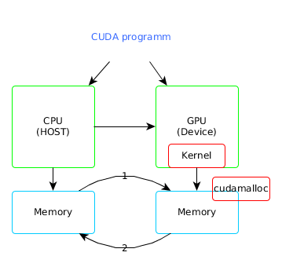

# Uda Parallel programming

Micheal Abrahms

## The GPU Programming Model

GPUs are now increasignly of interest as the CPU speed has stalled mostly due to
termal problems, GPUs have a higher latency and can do a lot of work on data,
but they run the same programm in the same data, while CPUs run different
instructions over different data.

The GPU approacho to the problem is to create simpler processors with less
debug and control HW, then the reduced complexity allows to add more processors
which are less efficient, less flexible and do not have debug capabilities.

#### latency
* Time
* Seconds

#### throughput

* Stuff/Time
* Jobs/hour

### Tipical GPU programm:

1. CPU allocates storage on GPU (malloc)
2. CPU  copies input data from cpu -> GPU memcpy (cudaMemcpy)
3. CPU launches kernel(s) on the GPU to process the data (kernel lauch)
4. CPU copies results back to CPU from GPU (memcpy)

The main idea of GPU computations is to write a program as if it were
to run on a single thread, but the GPU will run it on multiple threads.

Try to maximize the number of thread and the number of operations made
in a thread.

#### Core GPU design tenets(tenets = principles)

1. Lots of simple compute units. Trade simple control for more compute.
2. Explicitly parallel programming Model
3. Optimize for throughput not latency

### Programm diagram

1. Data CPU -> GPU
2. Data GPU -> CPU
(1,2) `cudaMemcpy`
3. Allocate GPU memory
(3) `cudaMalloc`
4. Launch kernel in GPU

- - -
Thread: One independent path of execution through the code.
